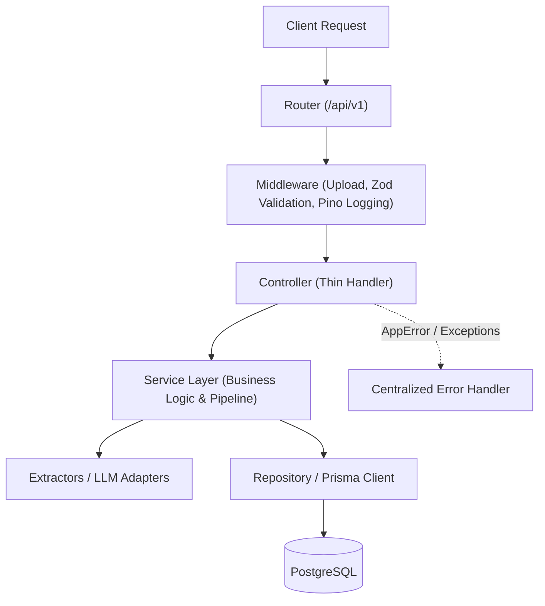

# Backend Architecture

## Design Principles

The Career OS backend is built with Node.js, Express, and TypeScript. It strictly enforces a layered architecture:



## Directory Organization

```
backend/src/
├── app.ts                 # Express application configuration & middleware pipeline
├── server.ts              # Server startup & graceful shutdown
├── config/                # Environment configuration (env.ts, google.ts)
├── controllers/           # HTTP request handlers (e.g., ingest.controller.ts)
├── errors/                # AppError class and centralized errorHandler middleware
├── middleware/            # Multer upload, Zod body/query validation
├── routes/                # Central route tree (/api/v1/...)
├── schemas/               # Zod validation schemas for requests and LLM outputs
├── services/              # Core business services
│   ├── extractors/        # Source extractors (PDF, Google Sheets, Google Docs, Web)
│   └── ingestion/         # Pipeline orchestration, chunking, LLM parsing
├── types/                 # Shared TypeScript interfaces & types
└── utils/                 # Utilities (Pino logger, string helpers)
```

## Key Architectural Patterns

### 1. Thin Controllers
Controllers are responsible only for:
1. Extracting parameters from `req.body`, `req.query`, or `req.file`.
2. Calling the appropriate service function.
3. Returning the response with standard HTTP status codes.
4. Catching unexpected errors and delegating to `next(err)`.

### 2. Service Separation
- Ingestion extraction logic is isolated in `src/services/extractors/`.
- Pipeline orchestration and batching logic reside in `src/services/ingestion/pipeline.service.ts`.
- LLM interaction and prompt structuring are encapsulated in `src/services/ingestion/llmParser.service.ts`.

### 3. Error Handling
- Throw `AppError(message, statusCode)` for predictable client errors.
- Uncaught exceptions or programming bugs are handled uniformly in `src/errors/errorHandler.ts`, returning a clean `{ success: false, error: message }` payload while logging detailed stack traces via Pino.

### 4. Logging
- Pino provides fast, structured JSON logging.
- HTTP requests are automatically logged with request IDs via `pino-http`.

