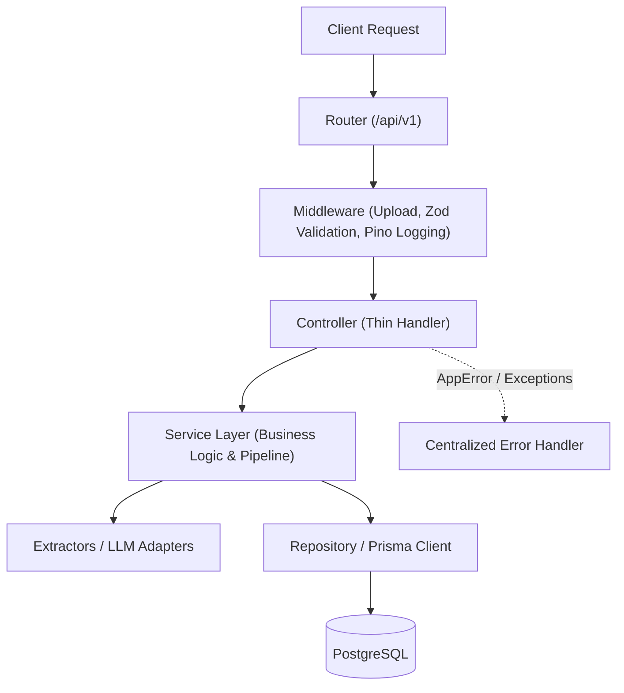

# Backend Architecture

## Design Principles

The Career OS backend is built with Node.js, Express, and TypeScript. It strictly enforces a layered architecture:



## Directory Organization

```
backend/src/
├── app.ts                 # Express application configuration & middleware pipeline
├── server.ts              # Server startup & graceful shutdown
├── config/                # Environment configuration (env.ts, db.ts, google.ts)
├── controllers/           # HTTP request handlers (user.controller.ts, ingest.controller.ts)
├── errors/                # AppError class and centralized errorHandler middleware
├── middleware/            # Auth guard, Multer upload, Zod body/query validation
├── repositories/          # Data access layer (user.repository.ts, roadmap.repository.ts)
├── routes/                # Central route tree (/api/v1/auth, /api/v1/ingest)
├── schemas/               # Zod validation schemas for requests and LLM outputs
├── services/              # Core business services (user.service.ts, roadmap.service.ts)
│   ├── extractors/        # Source extractors (PDF, Google Sheets, Google Docs, Web)
│   └── ingestion/         # Pipeline orchestration, chunking, LLM parsing
├── tests/                 # Automated test suites (auth.test.ts, test.ts)
├── types/                 # Shared TypeScript interfaces & types
└── utils/                 # Utilities (crypto.ts, tokens.ts, logger.ts)
```

## Key Architectural Patterns

### 1. Thin Controllers
Controllers are responsible only for:
1. Extracting parameters from `req.body`, `req.query`, or `req.file`.
2. Calling the appropriate service function.
3. Returning the response with standard HTTP status codes.
4. Catching unexpected errors and delegating to `next(err)`.

### 2. Service Separation
- Ingestion extraction logic is isolated in `src/services/extractors/`.
- Pipeline orchestration and batching logic reside in `src/services/ingestion/pipeline.service.ts`.
- LLM interaction and prompt structuring are encapsulated in `src/services/ingestion/llmParser.service.ts`.
- Identity and authentication orchestration reside in `src/services/user.service.ts`.

### 3. Repository Layer
- Encapsulates all Prisma ORM operations and database queries.
- Controllers and services do not execute direct SQL or Prisma queries; they invoke repository methods.
- Maintains strict types matching `@prisma/client` models.

### 4. Authentication & Session Architecture
- **Stateless Access Tokens**: Short-lived JWTs (15 min) carrying `userId` and `email` for low-latency authorization. Supported via HTTP cookies and `Authorization: Bearer <token>` headers.
- **Stateful Opaque Refresh Tokens**: Cryptographically random 40-byte hex strings stored as SHA-256 hashes in PostgreSQL `sessions`.
- **Refresh Token Rotation & Reuse Detection**: Rotating a refresh token revokes the previous token while preserving the `token_family`. If a compromised or revoked token is reused, all sessions in that family are immediately revoked.
- **Transport Security**: Transported via `httpOnly`, `sameSite: strict` signed cookies scoped to `/api/v1/auth`.

### 5. Error Handling
- Throw `AppError(message, statusCode)` for predictable client errors.
- Uncaught exceptions or programming bugs are handled uniformly in `src/errors/errorHandler.ts`, returning a clean `{ success: false, error: message }` payload while logging detailed stack traces via Pino.

### 6. Logging
- Pino provides fast, structured JSON logging.
- HTTP requests are automatically logged with request IDs via `pino-http`.


