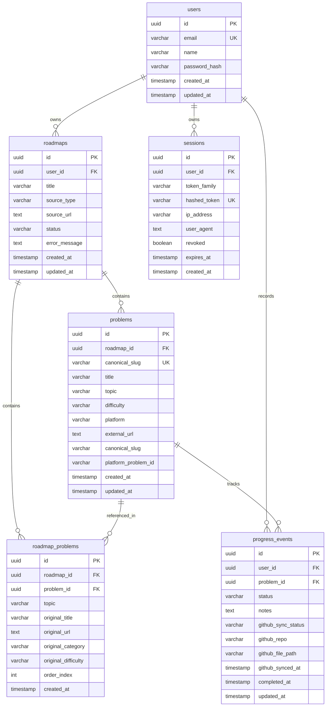

# Database Architecture

## Overview

Career OS utilizes **PostgreSQL** as its primary persistent relational data store.

The strict source of truth for the database design and Entity-Relationship Diagram (ERD) is:
```
database/schema.dbml
```

## Entity Relationship Model



## Relational Constraints & Rules

1. **Ownership & Cascades**:
   - `roadmaps.user_id` references `users.id` with `ON DELETE CASCADE`.
   - `problems.roadmap_id` references `roadmaps.id` with `ON DELETE CASCADE`.
   - `progress_events` reference both `users.id` and `problems.id` with `ON DELETE CASCADE`.
   - `roadmap_problems.roadmap_id` references `roadmaps.id` with `ON DELETE CASCADE`.
   - `roadmap_problems.problem_id` references `problems.id` with `ON DELETE CASCADE`.
   - `progress_events.user_id` references `users.id` with `ON DELETE CASCADE`.
   - `progress_events.problem_id` references `problems.id` with `ON DELETE CASCADE`.
   - `sessions.user_id` references `users.id` with `ON DELETE CASCADE`.
   - **Crucial Rule**: When a `Roadmap` is deleted, its `roadmap_problems` are deleted, but canonical `problems` and the user's `progress_events` are preserved. Deleting a roadmap never purges a user's DSA history.

2. **Identifiers**:
   - All primary keys use UUIDs generated via `gen_random_uuid()`.

3. **Session & Token Constraints**:
   - `sessions.hashed_token` has a `UNIQUE` constraint and index to guarantee fast O(1) lookups and single-use session tokens.
   - `sessions.token_family` is indexed for atomic invalidation during token reuse attack detection.
   - `sessions.user_id` and `sessions.expires_at` are indexed for lifecycle lookups and periodic garbage collection of expired sessions.

4. **Canonical Slugs**:
   - `problems.canonical_slug` provides a normalized identifier (e.g. `two-sum`, `lru-cache`) to cross-reference problems across multiple roadmaps or link with external platforms like LeetCode.
4. **Canonical Slugs & Identity Resolution**:
   - `problems.canonical_slug` is `UNIQUE` and stores a universal, platform-agnostic identifier (e.g. `two-sum`, `lru-cache`, `trapping-rain-water`).
   - Platform-specific details (such as GeeksforGeeks vs LeetCode practice links, custom roadmap titles, and topic classifications) are isolated within `roadmap_problems`.

5. **Progress States**:
5. **Progress & GitHub Sync States**:
   - `progress_events.status` values:
     - `SOLVED`: Problem successfully completed.
     - `ATTEMPTED`: Problem attempted but not yet fully solved.
     - `REVISE`: Problem flagged for spaced repetition / review.
   - `progress_events.github_sync_status` values:
     - `NOT_SYNCED`: Solution has not been synced to GitHub.
     - `PENDING`: Sync queued for background worker.
     - `SYNCED`: Successfully committed and pushed to the user's GitHub repository.
     - `FAILED`: Synchronization failed; eligible for retry.

## Roadmap Ingestion & Deduplication ("Clone-on-Ingest")

To prevent redundant LLM extraction costs when multiple users import the same source URL (e.g. popular sheets), the database serves as an extraction cache while strictly preserving individual user ownership:
To prevent redundant LLM extraction costs when multiple users import the same source URL (e.g. popular sheets like Striver SDE Sheet, NeetCode 150):

1. **Check Existing Source**:
   Query `roadmaps` for an existing completed extraction:
   ```sql
   SELECT id FROM roadmaps WHERE source_url = :url AND status = 'COMPLETED' LIMIT 1;
   SELECT id, title, source_type FROM roadmaps WHERE source_url = :url AND status = 'COMPLETED' LIMIT 1;
   ```
2. **Atomic Clone**:
2. **Atomic Clone with Canonical Linkages**:
   If an existing roadmap $R_1$ exists and `forceRefresh` is not set:
   ```sql
   -- 1. Create a distinct roadmap row for User B
   INSERT INTO roadmaps (id, user_id, title, source_type, source_url, status)
   VALUES (gen_random_uuid(), :userBId, :title, :sourceType, :sourceUrl, 'COMPLETED')
   RETURNING id; -- Returns $newRoadmapId

   -- 2. Fast atomic clone of all problems into User B's roadmap
   INSERT INTO problems (id, roadmap_id, title, topic, difficulty, external_url, canonical_slug)
   SELECT gen_random_uuid(), :newRoadmapId, title, topic, difficulty, external_url, canonical_slug
   FROM problems
   -- 2. Fast atomic clone of roadmap_problems pointing to canonical problems
   INSERT INTO roadmap_problems (id, roadmap_id, problem_id, topic, original_title, original_url, original_category, original_difficulty, order_index)
   SELECT gen_random_uuid(), :newRoadmapId, problem_id, topic, original_title, original_url, original_category, original_difficulty, order_index
   FROM roadmap_problems
   WHERE roadmap_id = :existingRoadmapId;
   ```
3. **Consequence**:
   - User B owns an isolated copy of the roadmap and problems.
   - User B's `progress_events` reference their own unique `problems.id`.
   - Ingestion executes in $\sim 5\text{ms}$ with 0 LLM tokens burned.
3. **Consequences**:
   - User B owns an isolated copy of the roadmap and roadmap-problem linkages.
   - User B's `progress_events` link directly to canonical `problems.id`. If User B already solved any of these problems in another roadmap, they automatically render as **SOLVED**.
   - Zero LLM tokens are consumed; execution completes in $\sim 10\text{ms}$.

## Migration & ORM Runtime (Prisma ORM v7)

1. **Schema & Config**:
   - `database/schema.dbml` defines the schema design.
   - `backend/prisma/schema.prisma` defines the Prisma models (datasource URLs are omitted per Prisma 7 standards).
   - `backend/prisma.config.ts` configures the migration and shadow database connection URLs for Prisma CLI.
2. **Driver Adapter Runtime**:
   - Prisma Client runtime utilizes `@prisma/adapter-pg` with a pooled `pg` client connection.
   - Centralized singleton client is exported from `backend/src/config/db.ts`.
3. **Running Migrations**:
   - Run `npx prisma migrate dev --name <migration_name>` inside `backend/`.
   - Commit the generated SQL migrations in `backend/prisma/migrations/`.


