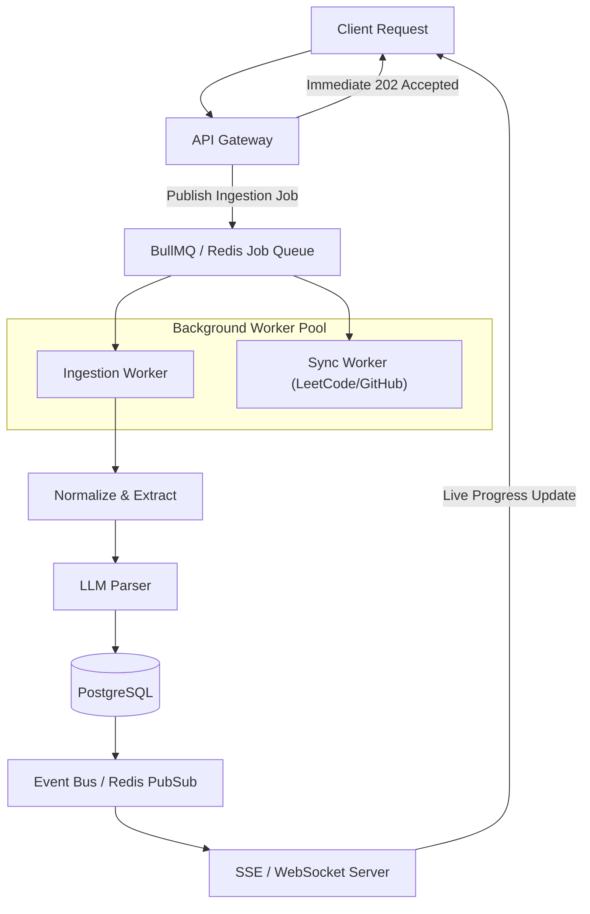

# Event-Driven Architecture & Background Processing

## Overview

While synchronous HTTP requests handle quick parsing operations, complex documents (large PDFs, massive Google Sheets, bulk imports) and external account synchronizations run through an event-driven background processing model.

## Active Queues & Worker Implementation

### 1. `email-queue` (Transactional Email Worker)
- **Producer**: [`src/queues/email.queue.ts`](file:///e:/DevProjects/COS/backend/src/queues/email.queue.ts)
- **Worker**: [`src/workers/email.worker.ts`](file:///e:/DevProjects/COS/backend/src/workers/email.worker.ts)
- **Job Name**: `send-verification-email`
- **Payload**: `{ to: string, name?: string | null, code: string }`
- **Retry Strategy**: 3 attempts with exponential backoff (2s, 4s, 8s).
- **Driver**: Resend API (production) or formatted console logger (development).

### 2. `ingestion-queue` (Roadmap Ingestion Worker)
- **Producer**: [`src/queues/ingestion.queue.ts`](file:///e:/DevProjects/COS/backend/src/queues/ingestion.queue.ts)
- **Worker**: [`src/workers/ingestion.worker.ts`](file:///e:/DevProjects/COS/backend/src/workers/ingestion.worker.ts)
- **Job Name**: `process-roadmap`
- **Payload**: `{ roadmapId: string, url: string, userId: string }`
- **Concurrency**: 2 concurrent extractions per worker instance to preserve memory and LLM rate-limits.
- **Retry Strategy**: 3 attempts with exponential backoff (5s, 10s, 20s).

### 3. Worker Pool Runner
- **File**: [`src/workers/index.ts`](file:///e:/DevProjects/COS/backend/src/workers/index.ts)
- **Execution**: `npm run worker`
- **Shutdown**: Intercepts `SIGINT` / `SIGTERM` and awaits `worker.close()` for all active queues before terminating.

## Core Events

### 1. Ingestion Lifecycle
- `roadmap.ingest.requested`: Triggered when a user submits a URL or uploads a PDF.
- `roadmap.chunk.processed`: Emitted as chunks complete LLM parsing (used for granular progress bars).
- `roadmap.ingest.completed`: Ingestion done, problems deduplicated and persisted.
- `roadmap.ingest.failed`: Ingestion encountered an unrecoverable failure.

### 2. Progress & Mastery Lifecycle
- `problem.status.changed`: Emitted when a user updates status (`SOLVED`, `ATTEMPTED`, `REVISE`).
- `problem.revision.due`: Emitted by the spaced repetition scheduler.
- `user.streak.updated`: Recalculates consecutive problem-solving days.

### 3. External Integrations
- `integration.leetcode.sync`: Scheduled cron pulling recent solved problems and mapping to existing `canonical_slug`s.
- `integration.github.sync`: Syncs daily commits and repository activity.

