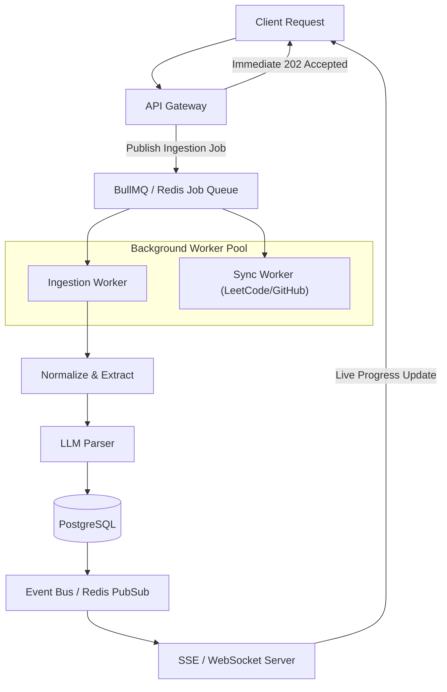

# Event-Driven Architecture & Background Processing

## Overview

While synchronous HTTP requests handle quick parsing operations, complex documents (large PDFs, massive Google Sheets, bulk imports) and external account synchronizations run through an event-driven background processing model.

## Core Events

### 1. Ingestion Lifecycle
- `roadmap.ingest.requested`: Triggered when a user submits a URL or uploads a PDF.
- `roadmap.chunk.processed`: Emitted as chunks complete LLM parsing (used for granular progress bars).
- `roadmap.ingest.completed`: Ingestion done, problems deduplicated and persisted.
- `roadmap.ingest.failed`: Ingestion encountered an unrecoverable failure.

### 2. Progress & Mastery Lifecycle
- `problem.status.changed`: Emitted when a user updates status (`SOLVED`, `ATTEMPTED`, `REVISE`).
- `problem.revision.due`: Emitted by the spaced repetition scheduler.
- `user.streak.updated`: Recalculates consecutive problem-solving days.

### 3. External Integrations
- `integration.leetcode.sync`: Scheduled cron pulling recent solved problems and mapping to existing `canonical_slug`s.
- `integration.github.sync`: Syncs daily commits and repository activity.

