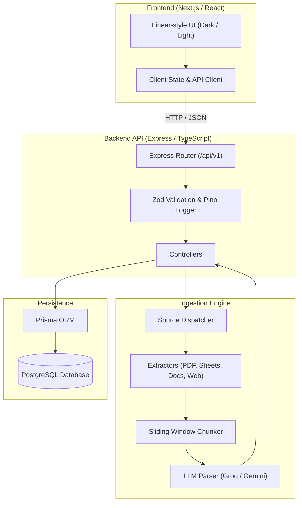

# System Architecture Overview

## Introduction

Career OS is an intelligent, personal career management platform designed to help software engineers structure learning paths, import roadmaps, and track coding progress.

## System Components

### 1. Frontend Web Client
- Minimalist, fast, keyboard-first interface inspired by Linear and Raycast.
- Fully supports dark and light modes with indigo-violet-cyan accents.
- Communicates with the backend REST API.

### 2. Backend Application Server
- Express.js and TypeScript.
- Thin controllers delegating work to specialized services.
- Structured request logging with `pino-http`.
- Centralized error handling and standard status code propagation.

### 3. Ingestion & AI Pipeline
- Ingestion dispatcher that normalizes varied document formats (PDFs, Google Sheets, Google Docs, DSA web pages) into normalized string lines.
- Sliding window chunking with controlled concurrency to prevent LLM rate limits.
- Structured problem extraction with JSON output parsing.

### 4. Database Layer
- PostgreSQL relational database.
- Database design defined and maintained in `database/schema.dbml`.
- Prisma client handles migrations and queries.

