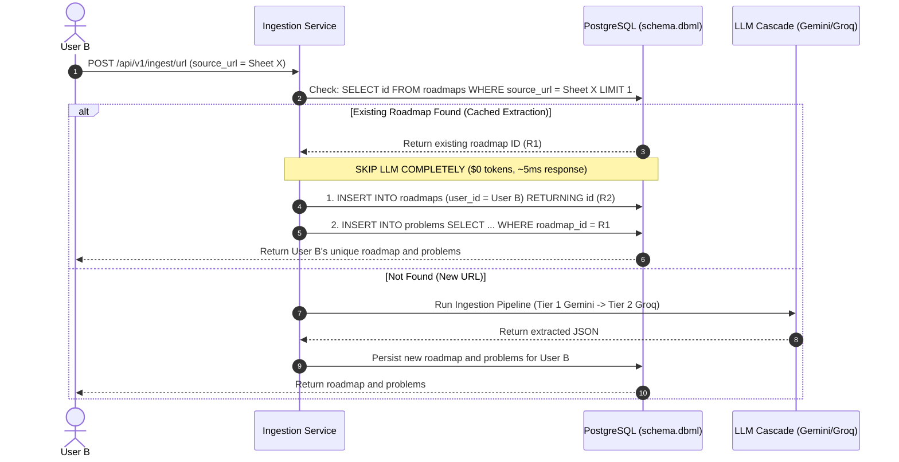

# ADR-002: Tiered LLM Provider Cascade and "Clone-on-Ingest" Database Caching

## Status
**Accepted**

## Context
1. **Rate Limits & API Constraints**:
   - Ingestion relies on LLMs to convert raw text from Google Sheets, Google Docs, and PDFs into structured DSA problem records.
   - Individual providers impose strict rate limits on free and preview tiers (e.g. Groq 8,000 TPM limit vs Gemini 1,000,000 TPM limit).
   - Synchronous processing of identical roadmaps submitted by multiple users (e.g. Striver's SDE Sheet, NeetCode 150) leads to redundant token consumption, high latency (60s+), and quota exhaustion.

2. **User Ownership vs Caching**:
   - When a user imports a roadmap, they must completely own their copy of the roadmap and its problems.
   - User progress tracking (`progress_events`), personal notes, and problem-level modifications must remain strictly isolated per user.
   - We need an architecture that avoids redundant LLM parsing while maintaining 100% individual user ownership without altering the entity relationships defined in `database/schema.dbml`.

---

## Decision

### 1. Tiered LLM Provider Fallback & Cascade
We adopt a multi-model fallback cascade across providers:
- **Tier 1 (Primary)**: **Google Gemini (`gemini-3.6-flash`)**:
  - High context window (1,000,000 tokens) and large response capacity (`maxOutputTokens: 32000`).
  - Capable of extracting hundreds of problems in a single pass without chunking.
  - High quota (1,000,000 TPM, 15 RPM).
- **Tier 2 (Fallback)**: **Groq (`openai/gpt-oss-20b`)**:
  - Automatically activated if Tier 1 encounters rate limits (`429`), quota exhaustion, or API unavailability.
  - Uses safe sliding-window chunking (7 lines, 1 overlap, `maxOutputTokens: 1500`) with exponential backoff (8s pause on 429).
- **Model Rotation & Cooldown**:
  - Rate-limited providers enter a temporary 60-second cooldown to let provider sliding windows reset before retrying.

### 2. "Clone-on-Ingest" SQL Deduplication Pattern
Before triggering any LLM extraction, the ingestion service checks the database for an existing extraction matching the `source_url`:

- **Force Refresh**:
  An optional `forceRefresh: boolean` flag in the ingestion payload allows users to bypass database extraction caching if upstream content has been updated.

---

## Consequences

### Positive
- **100% User Isolation**: Every user receives distinct `roadmaps.id` and `problems.id` records. Updating `progress_events` for one user never affects another.
- **Zero Schema Changes**: Fully compatible with the existing `database/schema.dbml` design. No complex many-to-many subscription join tables required.
- **Instant Response Time**: Cached roadmaps return in $\sim 5\text{ms}$ via SQL batch inserts instead of 60 seconds of LLM streaming.
- **Massive Token & Cost Savings**: Popular shared sheets are parsed by an LLM once; subsequent imports consume 0 LLM tokens.
- **High Availability**: If any LLM provider experiences an outage or temporary rate limit, failover models handle requests seamlessly.

### Negative / Trade-offs
- **Storage Redundancy**: Duplicating problem rows across roadmaps consumes more database rows than a shared global problem bank. However, problem rows consist entirely of short strings and UUIDs, making storage costs negligible compared to LLM compute costs.
- **Upstream Updates**: Changes made to an external Google Sheet after initial ingestion require a `forceRefresh` call to re-extract updated content.

