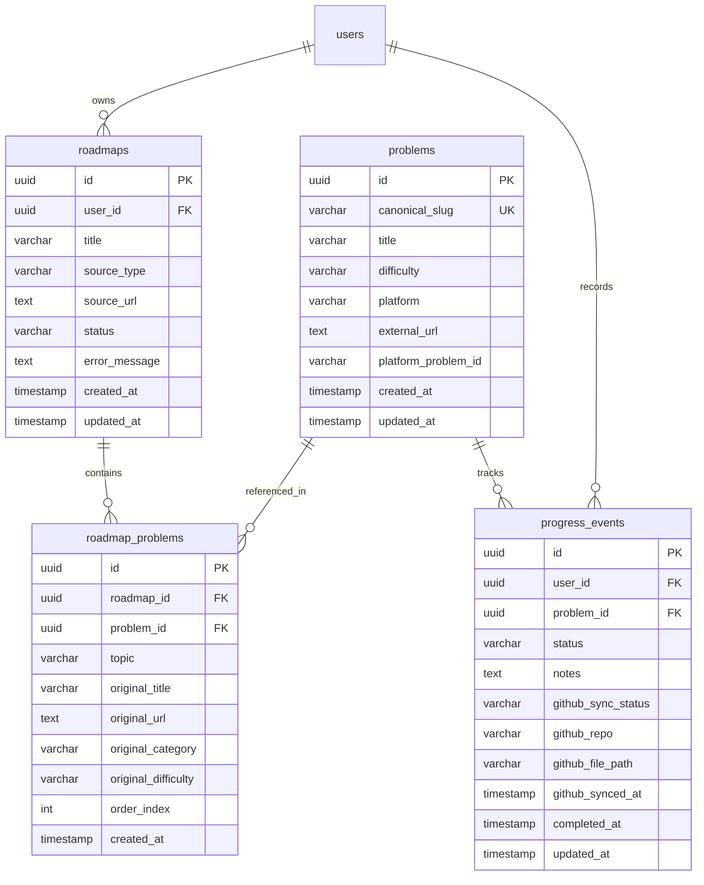
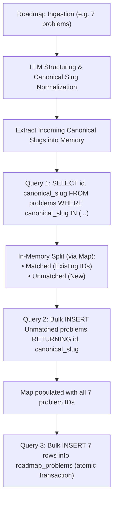

# ADR-003: Canonical Problem Bank, Identity Resolution, and Cross-Roadmap Progress Synchronization

## Status
**Accepted**

## Context

### 1. The Cross-Roadmap Silo Problem
In the initial schema (`database/schema.dbml` and `backend/prisma/schema.prisma`), each `Problem` was tightly coupled to a single `Roadmap` via `roadmap_id uuid [not null]`.
Consequently:
- If a user imported multiple roadmaps (e.g. "Striver SDE Sheet" and "NeetCode 150"), common problems like "Two Sum" were duplicated into isolated rows.
- When the user solved "Two Sum" in Roadmap A, Roadmap B had no knowledge of this completion. The user had to manually re-mark it solved in every roadmap.
- User progress, notes, and future GitHub synchronization were fragmented across disconnected problem records.

### 2. The Cross-Platform Identity Problem
Roadmaps originate from different platforms and creators:
- Striver's sheet may link to `https://leetcode.com/problems/two-sum`.
- A GeeksforGeeks sheet may call it "Key Pair" and link to `https://www.geeksforgeeks.org/problems/key-pair5556/1`.
- A CodeStudio sheet may call it "Pair Sum".
Prefixing problem identity with the platform (e.g. `leetcode:two-sum` vs `gfg:key-pair`) prevents deduplication. Regardless of platform or practice URL, the underlying algorithmic concept is identical and should share a single canonical identity.

### 3. Downstream Lifecycle Requirements
Following problem completion, the platform roadmap entails:
- User submission & execution tracking.
- AI code review and complexity analysis.
- Personal notes and revision logs.
- Automatic synchronization of verified solutions to the user's personal GitHub repository (e.g. `solutions/two-sum.py`).
To prevent repository clutter and disjointed commits, each problem must resolve to a single canonical slug.

---

## Decision

### 1. Canonical Problem Bank & Many-to-Many Architecture
We decouple `problems` from `roadmaps` by introducing a junction table `roadmap_problems`:

- **`problems` (Global Canonical Bank)**:
  - `canonical_slug`: Universal, platform-agnostic kebab-case slug (e.g. `two-sum`, `trapping-rain-water`, `reverse-linked-list`). UNIQUE across the system.
  - `title`: Canonical clean problem name.
  - `difficulty`: Universal difficulty (`EASY`, `MEDIUM`, `HARD`, `UNKNOWN`).
- **`roadmap_problems` (Junction & Roadmap Metadata)**:
  - Connects `roadmap_id` and `problem_id` with composite unique constraint `(roadmap_id, problem_id)`.
  - Preserves how the specific roadmap presented the problem: `original_title`, `original_url`, `topic`, `original_category`, `original_difficulty`, `order_index`.
  - `original_url` is NOT globally unique, preventing constraint crashes when multiple roadmaps reference the same practice link.
- **`progress_events` (User Progress & GitHub Sync)**:
  - Bound to `(user_id, problem_id)`.
  - Includes GitHub sync lifecycle: `github_sync_status` (`NOT_SYNCED`, `PENDING`, `SYNCED`, `FAILED`), `github_repo`, `github_file_path`, `github_synced_at`.

---

### 2. Ingestion & Batch Identity Resolution Flow

When a roadmap is ingested and the LLM extracts structured candidate items:

#### Batch Matching Algorithm:
1. Extract array of canonical slugs from LLM candidates: `const slugs = candidates.map(c => c.canonicalSlug)`.
2. Single query: `SELECT id, canonical_slug FROM problems WHERE canonical_slug IN (:slugs)`.
3. Build lookup map: `slugToIdMap: Map<canonicalSlug, problemId>`.
4. Partition candidates into `unmatched = candidates.filter(c => !slugToIdMap.has(c.canonicalSlug))`.
5. If `unmatched.length > 0`: Execute `INSERT INTO problems (...) RETURNING id, canonical_slug` (via Prisma `createManyAndReturn`). Merge returned IDs into `slugToIdMap`.
6. Batch insert into `roadmap_problems` using `slugToIdMap.get(c.canonicalSlug)!`.

All operations execute inside a database transaction (`prisma.$transaction`).

---

### 3. Clone-on-Ingest Optimization with Canonical Links
When User B imports a `source_url` already ingested and completed in the system:
1. Backend checks `roadmaps` for matching `source_url` with `status = 'COMPLETED'`.
2. Scrapers and LLM calls are completely skipped ($0 token cost, $\sim 10\text{ms}$ execution).
3. Backend creates a new `roadmaps` record for User B.
4. Backend clones `roadmap_problems` rows from the existing roadmap, referencing the **identical canonical `problem_id`s**.
5. If User B previously solved any of these canonical problems in another roadmap, they immediately render as **SOLVED** for User B.

---

## Consequences

### Positive
- **Automatic Cross-Roadmap Progress**: Completing a problem anywhere marks it complete across all roadmaps containing that problem for that user.
- **100% User Isolation**: User progress is scoped by `user_id`; User A completing a problem has zero impact on User B.
- **Preserved Roadmap Context**: Original sheet column names, problem names, order indexes, and platform links remain intact in `roadmap_problems`.
- **Optimal DB Performance**: Problem persistence requires only 2 to 3 batch SQL queries total per roadmap ingestion.
- **GitHub Sync Readiness**: Solutions sync cleanly to a single canonical file (e.g. `solutions/two-sum.py`) without duplicate entries.

### Negative / Trade-offs
- Deleting a roadmap requires cascading deletion of `roadmap_problems` rows, while preserving canonical `problems` and `progress_events`.
- In rare edge cases where two distinct problems share an ambiguous name across platforms, identity resolution relies on LLM domain intelligence or explicit URL pattern matching to avoid false canonical collisions.

