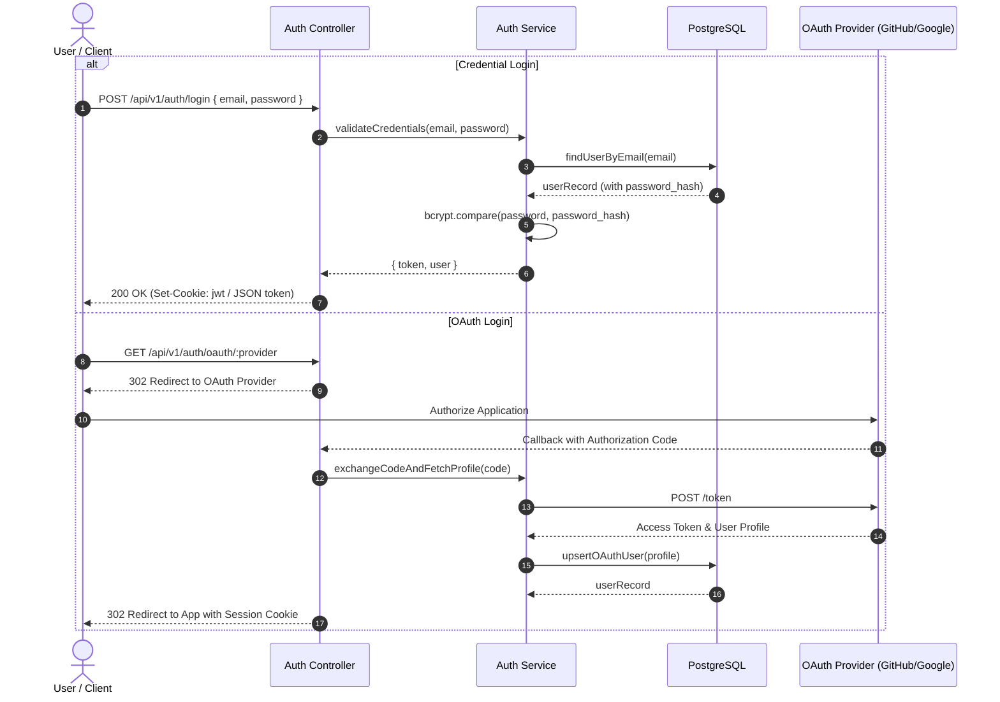

# Authentication & Identity Flow

## Overview

Career OS supports both credential-based (email + password) and OAuth 2.0 authentication flows (GitHub, Google).

## Security Requirements

1. **Password Hashing**: Passwords must be hashed using `bcrypt` or `argon2` with a minimum cost factor of 12. Never store plaintext passwords.
2. **Tokens**: JWTs should be signed with strong secrets (`JWT_SECRET`) and carry a short expiration (e.g., 15-60 minutes).
3. **Session Transport**: Prefer `HttpOnly`, `Secure`, `SameSite=Lax` cookies to prevent XSS credential theft.
4. **OAuth User Records**: OAuth users have `password_hash = NULL` in `users` table.

