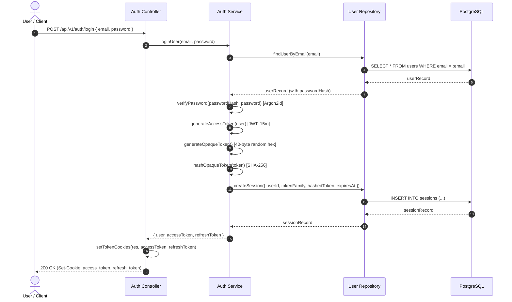
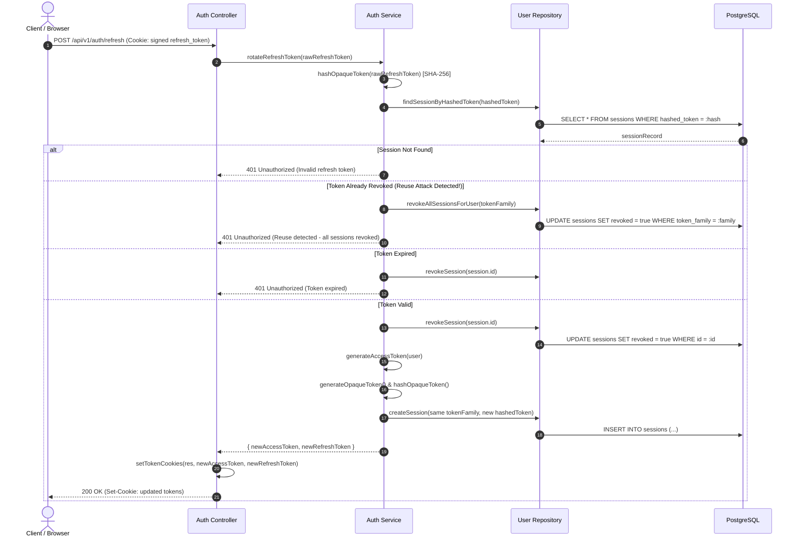

# Authentication & Identity Flow

## Overview

Career OS supports credential-based (email + password) and OAuth 2.0 authentication flows (GitHub, Google) with a dual-token session architecture:
- **Access Token**: Short-lived JWT (15 minutes) for stateless authentication.
- **Refresh Token**: Long-lived opaque token (7 days) stored hashed in PostgreSQL with single-use rotation and token family reuse detection.

---

## 1. Credential Login & Session Creation

---

## 2. Refresh Token Rotation & Reuse Detection

---

## 3. Endpoints Specification

| Method | Endpoint | Auth Required | Request Body / Cookies | Success Response |
| :--- | :--- | :--- | :--- | :--- |
| `POST` | `/api/v1/auth/register` | None | `{ name, email, password }` | `201 Created` + User info (`isEmailVerified: false`) |
| `POST` | `/api/v1/auth/verify-email` | None | `{ email, code }` | `200 OK` + HTTP cookies (Auto-Login!) + User info |
| `POST` | `/api/v1/auth/resend-verification` | None | `{ email }` | `200 OK` + Success message |
| `POST` | `/api/v1/auth/login` | None | `{ email, password }` | `200 OK` + HTTP cookies + User info |
| `POST` | `/api/v1/auth/refresh` | Signed Cookie | Cookie: `refresh_token` | `200 OK` + rotated cookies |
| `POST` | `/api/v1/auth/logout` | Optional | Cookie: `refresh_token` | `200 OK` + cleared cookies |
| `GET` | `/api/v1/auth/me` | Bearer or Cookie | Header / `access_token` cookie | `200 OK` + User profile |

---

## 4. Security Requirements & Standards

1. **Password Hashing**: Passwords are hashed using **Argon2id** (`memoryCost: 65536` [64MB], `timeCost: 3`, `parallelism: 4`). Plaintext passwords are never stored.
2. **Access Tokens**: Signed using `ACCESS_TOKEN_SECRET` with a 15-minute expiration (`expiresIn: '15m'`). Validated via `authenticate` middleware. Accepts both HTTP cookies and `Authorization: Bearer <token>` headers.
3. **Refresh Tokens**: Cryptographically secure 40-byte hex strings. Transferred as **signed** cookies (`COOKIE_SECRET`) with `path: '/api/v1/auth'`.
4. **Database Storage**: Refresh tokens are hashed via SHA-256 (`crypto.createHash('sha256')`) prior to insertion in PostgreSQL `sessions`. Even if the database is compromised, active session tokens cannot be derived.
5. **Token Reuse Defense**: Every refresh operation invalidates the current token. If an attacker attempts to replay an invalidated token, all sessions in that `token_family` are immediately terminated.
6. **Cookie Security**:
   - `httpOnly: true` (prevents JavaScript access / XSS theft)
   - `sameSite: 'strict'` (prevents CSRF token transmission)
   - `secure: true` in production environments

