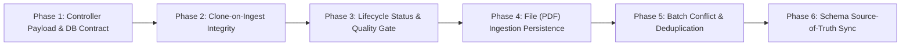

# Ingestion Pipeline: Issues & Phase-by-Phase Implementation Plan

This document outlines the identified issues in the Career OS ingestion flow (`ingest.controller.ts` down to repositories and database) and structures the fixes into actionable, incremental phases.

---

## Overview of Phases



---

## Phase 1: Controller Payload & Roadmap Creation (Fixing Fatal Runtime Crash)

### Context & Problem
In `backend/src/controllers/ingest.controller.ts`:
```typescript
// Line 29:
const roadmap: Roadmap = await roadmapService.createRoadmap(req.body);
```
- After passing through `validateUrl`, `req.body` only contains `{ url: string }`.
- `RoadmapRepository.createRoadmap(data: RoadmapInput)` passes this object directly into `prisma.roadmap.create({ data })`.
- The `Roadmap` model in `prisma/schema.prisma` requires the following non-nullable fields:
  - `userId`: **Required** (exists on `req.user!.userId`, but never passed)
  - `title`: **Required** (does not exist on `req.body`)
  - `sourceType`: **Required** (does not exist on `req.body`)
  - `sourceUrl`: The Prisma column name is `sourceUrl`, whereas `req.body` provides `url`
- **Result**: Every fresh URL submission crashes immediately at line 29 with a `PrismaClientValidationError`, completely halting the rest of the flow.

### Action Items
- [x] **1.1 Determine `sourceType` automatically**:
  - Detect source type in controller or service based on URL matching (e.g. `'GOOGLE_SHEETS'`, `'GOOGLE_DOCS'`, `'URL'`).
- [x] **1.2 Supply a `title`**:
  - Allow the client to pass an optional `title` in the request body (extend `IngestUrlSchema`), or provide a sensible fallback title (e.g. `"DSA Roadmap - " + new Date().toISOString().split('T')[0]`).
- [x] **1.3 Pass clean `RoadmapInput` to service**:
  ```typescript
  const roadmap = await roadmapService.createRoadmap({
    userId: req.user!.userId,
    title: req.body.title || 'DSA Roadmap',
    sourceType: detectedSourceType,
    sourceUrl: url,
    status: RoadmapStatus.PROCESSING,
  });
  ```

---

## Phase 2: Clone-on-Ingest Identity & Response Integrity

### Context & Problem
In `backend/src/controllers/ingest.controller.ts`:
```typescript
// Lines 22-27:
const roadmapId = await roadmapService.roadmapExists(url);
if (roadmapId) {
  await roadmapService.cloneRoadmap(roadmapId, req.user!.userId);
  res.status(201).json({ success: true, message: 'roadmap created successfully', data: roadmapId });
  return;
}
```
1. **Wrong ID Returned**: `roadmapService.cloneRoadmap` creates and returns the newly cloned `Roadmap` object in a transaction. However, the controller discards this return value and responds with `data: roadmapId`, which is the ID of the **source/template** roadmap belonging to someone else.
2. **Duplicate Self-Cloning**: `roadmapExists(url)` looks up any `COMPLETED` roadmap matching the source URL across the entire database. If the logged-in user submits their own previously ingested URL, it will clone a redundant duplicate copy under the same user account.

### Action Items
- [x] **2.1 Capture and return new Cloned Roadmap ID**:
  ```typescript
  const cloned = await roadmapService.cloneRoadmap(roadmapId, req.user!.userId);
  res.status(201).json({
    success: true,
    message: 'Roadmap cloned successfully',
    data: { roadmapId: cloned.id },
  });
  ```
- [x] **2.2 Check user ownership prior to cloning**:
  - If the existing roadmap already belongs to the logged-in user (`existingRoadmap.userId === req.user.userId`), return the user's existing roadmap directly instead of creating an unnecessary clone.
- [x] **2.3 Standardize JSON response contract**:
  - Unify API responses across cache-hit and cache-miss branches (e.g. `{ success: true, message: string, data: { roadmapId: string } }`).

---

## Phase 3: Pipeline Quality Gate & Lifecycle Status Management

### Context & Problem
1. **Unchecked Pipeline Failure**:
   In `ingestUrl`, the return value of `processDocumentPipeline` is never checked for `if (!result.success)`. If 0 DSA problems are detected, the pipeline returns `{ success: false, data: [] }`. The controller still calls `saveExtractedProblems(roadmap.id, [])` and returns HTTP 201 Created, leaving an empty roadmap in the database.
2. **Orphaned Roadmaps on Error**:
   If an exception occurs during text extraction or LLM parsing (e.g. network failure, invalid page), execution jumps directly to `catch (err) { next(err); }`. The roadmap record created at the beginning remains orphaned in PostgreSQL, never marked as `FAILED`, and without an `errorMessage`.

### Action Items
- [x] **3.1 Check Quality Gate in `ingestUrl`**:
  ```typescript
  if (!result.success || result.data.length === 0) {
    await roadmapService.updateStatus(roadmap.id, RoadmapStatus.FAILED, result.message || 'No DSA problems detected');
    res.status(422).json({ success: false, message: result.message, data: [] });
    return;
  }
  ```
- [x] **3.2 Handle Failure Path in Catch Block**:
  - When an error is caught, if a roadmap was already created, update its status to `FAILED` with the error details to avoid ghost records:
  ```typescript
  if (createdRoadmapId) {
    await roadmapService.updateStatus(createdRoadmapId, RoadmapStatus.FAILED, (err as Error).message);
  }
  ```
- [x] **3.3 Transition Status to `COMPLETED` upon successful persistence**:
  - Set the initial status to `PENDING` or `PROCESSING`, and update to `COMPLETED` only after `saveExtractedProblems` successfully finishes.

---

## Phase 4: File (PDF) Ingestion Persistence

### Context & Problem
In `backend/src/controllers/ingest.controller.ts`:
```typescript
export async function ingestFile(req: Request, res: Response, next: NextFunction): Promise<void> {
  // ...
  const rawLines = await normalizePdf(req.file.buffer);
  const result = await processDocumentPipeline(rawLines);
  if (!result.success) {
    res.status(422).json(result);
    return;
  }
  res.status(200).json(result); // Only returns JSON, never saved to DB!
}
```
- `ingestFile` extracts raw lines from the PDF and parses problems with the LLM, but **never creates a Roadmap record** and **never calls `problemService.saveExtractedProblems`**.
- The PDF upload endpoint currently only acts as an ephemeral in-memory parser.

### Action Items
- [ ] **4.1 Create Roadmap record for uploaded PDF**:
  - `sourceType: 'PDF'`
  - `title: req.file.originalname` (or custom title from request body)
  - `userId: req.user!.userId`
- [ ] **4.2 Persist Extracted Problems**:
  - Call `await problemService.saveExtractedProblems(roadmap.id, result.data)`.
- [ ] **4.3 Return standardized response**:
  - Return the created roadmap ID and extraction statistics, consistent with `ingestUrl`.

---

## Phase 5: Problem Deduplication & Junction Table Conflict Prevention

### Context & Problem
In `backend/src/services/problems.service.ts`:
1. **Pipeline Deduplication Gap**:
   `pipeline.service.ts` only deduplicates items by raw string comparison: `url || title`. If a document contains multiple variations of the same problem link (e.g. `https://leetcode.com/problems/two-sum` vs `https://leetcode.com/problems/two-sum/description`, or LeetCode + GFG links for the same question), both items pass pipeline deduplication.
2. **PostgreSQL Batch Error 21000**:
   In `saveExtractedProblems`, both items resolve to the **same `canonicalSlug`** and the **same `problemId`**.
   When constructing `roadmapProblemsData`, two entries share the identical composite key `(roadmapId, problemId)`.
   When executing `prisma.roadmapProblem.createMany({ data, skipDuplicates: true })`:
   **PostgreSQL throws a fatal error**: `ERROR: 21000: ON CONFLICT DO NOTHING cannot affect row a second time`, causing the entire batch insert to fail.
3. **Empty Slug Vulnerability**:
   If a problem title contains only symbols or unsupported characters and lacks a recognizable URL, `resolveCanonicalSlug` can produce an empty string `""`, leading to unique constraint collisions on `problems.canonical_slug`.

### Action Items
- [x] **5.1 Deduplicate by `canonicalSlug` before constructing junction rows**:
  - In `ProblemService.saveExtractedProblems`, deduplicate by `canonicalSlug` so every `(roadmapId, problemId)` pair passed to `createRoadmapProblems` is distinct within the batch.
- [x] **5.2 Empty Slug Fallback in `canonicalSlug.ts`**:
  - If `slugifyTitle(title)` produces an empty string, generate a safe fallback (e.g. `"problem-" + hash(title)`), preventing empty slugs.
- [x] **5.3 Transactional Safety (Recommended)**:
  - Wrap `findProblemsByCanonicalSlugs`, `createManyCanonicalProblems`, and `createRoadmapProblems` within `prisma.$transaction` for atomicity.

---

## Phase 6: Schema Source-of-Truth Sync (`schema.dbml`)

### Context & Problem
Per Rule #3 in `AGENTS.md`, `database/schema.dbml` is the source of truth for database design.
Currently, `database/schema.dbml` is out of sync with `backend/prisma/schema.prisma`:
- The `problems` table in `schema.dbml` still contains outdated fields from before ADR-003: `roadmap_id`, `topic`, and duplicate definitions of `canonical_slug`.
- Per ADR-003 and `prisma/schema.prisma`, `problems` is now a canonical global bank without `roadmap_id` or `topic`, and relations are managed through `roadmap_problems`.

### Action Items
- [ ] **6.1 Update `database/schema.dbml`**:
  - Remove `roadmap_id`, `topic`, and redundant `canonical_slug` definitions from `problems`.
  - Ensure DBML is 100% aligned with `prisma/schema.prisma`.

---

## Progress Tracking Matrix

| Phase | Component | Status | Assigned / Notes |
|---|---|---|---|
| **Phase 1** | `ingestUrl` Payload & Creation | ✅ Completed | Fixed Prisma contract (`userId`, `title`, `sourceUrl`, `sourceType`) |
| **Phase 2** | Clone-on-Ingest Flow | ✅ Completed | Return cloned ID, handle self-cloning, support custom title |
| **Phase 3** | Status & Quality Gate | ✅ Completed | Check `result.success`, handle FAILED in catch, mark COMPLETED |
| **Phase 4** | `ingestFile` Persistence | ⏸️ Paused / Skipped | Deferred per user instructions |
| **Phase 5** | Canonical Deduplication | ✅ Completed | Prevent PG 21000 error, add empty slug fallback & transaction |
| **Phase 6** | DBML Schema Alignment | ⬜ Not Started | Clean up `database/schema.dbml` |
