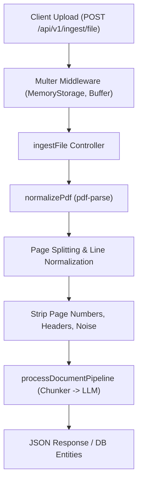

# PDF Ingestion Flow

## Overview

Career OS supports uploading multi-page PDF roadmaps, cheat sheets, and curriculum documents.

## Processing Details

### 1. File Upload Constraints
- Supported format: `application/pdf`.
- Stored as memory buffer via Multer to avoid temporary disk persistence security risks.
- Enforces strict file size limits (default: 10MB).

### 2. PDF Parsing (`services/extractors/pdf.extractor.ts`)
- Utilizes `pdf-parse` to extract text from all document pages.
- Splits extracted text by line breaks (`\n`, `\r\n`).
- Strips non-informative artifacts:
  - Repeated headers and footers.
  - Standalone page numbers (e.g. `Page 3 of 12`).
  - Blank lines and whitespace padding.
- Outputs structured `string[]` ready for sliding window chunking.

### 3. Edge Cases Handled
- **Encrypted / Password Protected PDFs**: Handled with explicit 400 Bad Request error.
- **Scanned (Image-Only) PDFs**: Detected by empty text extraction, prompting the user to submit an OCR-processed or text-searchable document.

