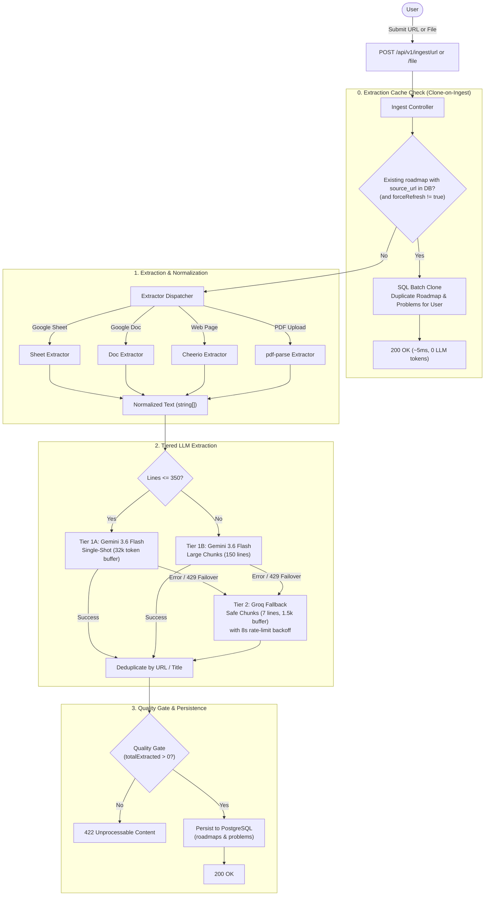

# Roadmap Ingestion Flow

## Overview

The roadmap ingestion pipeline ingests unstructured learning materials and converts them into structured, trackable entities (`roadmaps`, `problems`).

## Step-by-Step Pipeline

1. **Submission**:
   - `POST /api/v1/ingest/url`: Validated body `{ url: string, forceRefresh?: boolean }`.
   - `POST /api/v1/ingest/file`: Multipart upload (`multer`) with PDF file.

2. **Extraction Cache Check ("Clone-on-Ingest")**:
   - If `source_url` exists in the `roadmaps` table and `forceRefresh` is not requested, the backend bypasses the LLM entirely.
   - It performs an atomic SQL clone into a new `roadmaps` and `problems` record set assigned directly to the requesting user.
   - Response time: $\sim 5\text{ms}$; LLM tokens consumed: 0.

3. **Extraction (`src/services/extractors/`)**:
   - For novel URLs, the dispatcher determines the source type and extracts textual content into an array of clean lines (`string[]`).

4. **Tiered LLM Parsing (`src/services/ingestion/llmParser.service.ts`)**:
   - **Tier 1 (Google Gemini 3.6 Flash)**: Handles up to 350 lines in a single pass with `maxOutputTokens: 32000`. Larger documents are partitioned into 150-line blocks.
   - **Tier 2 (Groq Fallback)**: If Gemini experiences quota limits or errors, the pipeline automatically fails over to Groq (`openai/gpt-oss-20b`) with 7-line chunks and 8-second 429 backoff retry pacing.

5. **Deduplication & Quality Gate**:
   - Problems extracted from the LLM are deduplicated by URL or canonicalized title.
   - If 0 problems are found, an error (422) is returned.
   - On success, problems and roadmap records are persisted to PostgreSQL.

