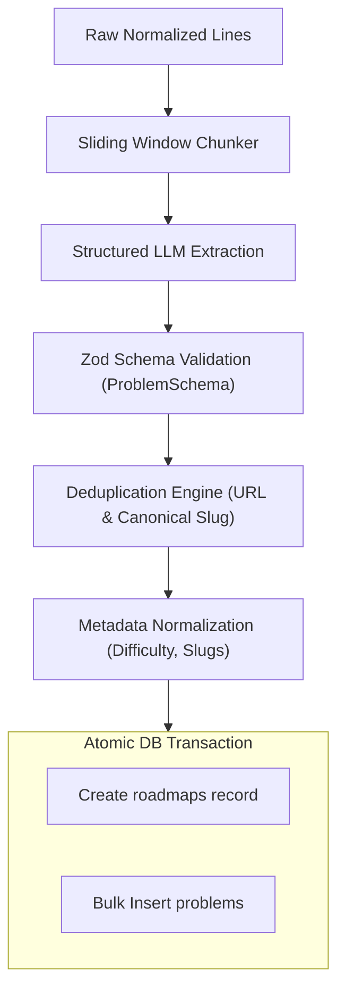

# Roadmap Processing Flow

## Overview

After the raw lines are extracted from a source, the processing engine transforms them into structured database entities.

## Transformation Stages

### 1. Canonical Slug Generation
- Every problem is assigned a `canonical_slug` derived from its title or standard LeetCode/NeetCode naming:
  - `"Two Sum"` → `two-sum`
  - `"Best Time to Buy and Sell Stock"` → `best-time-to-buy-and-sell-stock`
- Canonical slugs prevent duplicates and enable linking progress across disparate roadmaps (e.g., Striver's SDE Sheet and Blind 75 sharing the same problem).

### 2. Difficulty Standardization
- LLM extracts difficulty levels, which are clamped to:
  - `Easy`
  - `Medium`
  - `Hard`
- If undefined, difficulty is inferred or left `null` until enriched.

### 3. Deduplication Engine
- Compares items within the extraction batch using URL matching first, followed by lowercased title / slug matching.
- Merges topic tags when the same problem appears under multiple categories.

### 4. Database Persistence
- Executed inside a Prisma transaction:
  1. Insert `roadmaps` row with `user_id`, `title`, `source_type`, and `source_url`.
  2. Bulk insert `problems` with generated `roadmap_id`.

