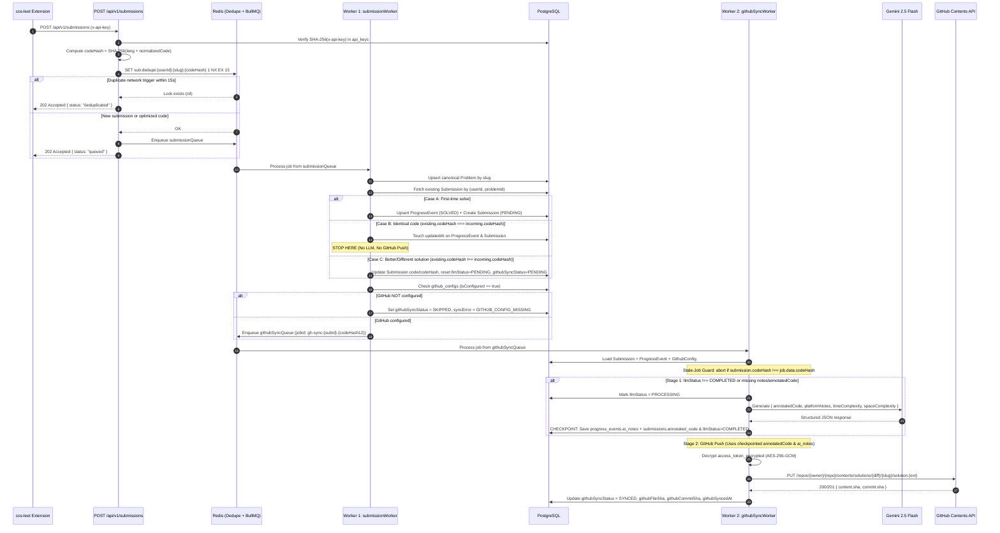

# `cos-leet` Submission & GitHub Sync Pipeline — Architectural Specification & Action Plan

## 1. Executive Summary

This document specifies the production architecture for the **`cos-leet` Chrome Extension → Career OS Backend** submission ingestion, AI revision note generation, and GitHub synchronization pipeline.

### Core Design Principles
1. **Two-Queue Decoupled Pipeline (`submissionQueue` → `githubSyncQueue`)**:
   - **Queue 1 (`submissionQueue`)**: Fast, high-reliability database persistence of user progress (`progress_events`) and solution code (`submissions`). Guaranteed to succeed even if Gemini LLM or GitHub APIs are down or unconfigured.
   - **Queue 2 (`githubSyncQueue`)**: Slower external I/O worker executing a **2-Stage Checkpointed Pipeline** (Stage 1: Gemini 2.5 Flash evaluation → PostgreSQL checkpoint; Stage 2: GitHub Contents API push).
2. **4-Layer Idempotency & Deduplication**:
   - Protects against Chrome extension duplicate network triggers, same-problem re-submissions, BullMQ retries, and out-of-order concurrent worker execution.
3. **Strict Separation of Concerns in PostgreSQL**:
   - Keeps the `users` table 100% free of third-party tokens or extension credentials by isolating `api_keys` (1:N) and `github_configs` (1:1).
   - Separates lightweight roadmap status + AI revision notes (`progress_events`) from heavy code payloads, LLM artifacts, and GitHub SHA tracking (`submissions`).
4. **Dual-Output Single LLM Call**:
   - A single structured JSON call to `gemini-2.5-flash` produces both:
     1. **`annotatedCode`**: The user's exact working code enriched with inline step-by-step comments explaining the logic — pushed to the user's GitHub repository.
     2. **`platformNotes`**: A concise Markdown revision guide (Intuition, Approach, Key Trick, Complexity) — saved to `progress_events.ai_notes` for fast revision inside the Career OS UI.

---

## 2. End-to-End Architecture



---

## 3. Existing Codebase Audit & Bugs to Fix

An audit of the existing scaffolded files revealed **5 critical bugs** that prevent the submission pipeline from functioning:

| # | Bug | Affected File(s) | Root Cause | Fix |
| :- | :--- | :--- | :--- | :--- |
| **1** | **Queue Name Mismatch** | `backend/src/queues/githubSync.queue.ts`<br>`backend/src/workers/githubsync.worker.ts` | Queue enqueues to `'github-sync-queue'`, while Worker listens on `'github-sync'`. Jobs are orphaned in Redis forever. | Export `GITHUB_SYNC_QUEUE_NAME = 'github-sync-queue'` from `githubSync.queue.ts` and import it directly in `githubsync.worker.ts`. |
| **2** | **Unregistered Workers** | `backend/src/workers/index.ts` | Only `emailWorker` and `ingestionWorker` are started in `startWorkers()`. `submissionWorker` and `githubSyncWorker` are never imported or started. | Export factory functions `createSubmissionWorker()` and `createGithubSyncWorker()` and register both in `backend/src/workers/index.ts` with graceful shutdown. |
| **3** | **Stubbed `verifyApiKey`** | `backend/src/middleware/auth.middleware.ts` | `verifyApiKey` has its check commented out, does not query the database, and does not populate `req.user`. | Hash incoming `x-api-key` with SHA-256, look up active key in `api_keys` (`revoked_at IS NULL`), attach `req.user = { userId: apiKey.userId }`, and asynchronously update `last_used_at`. |
| **4** | **Wrong `submissionId` Passed** | `backend/src/workers/submission.worker.ts` | Passes `submissionId: job.id` (the BullMQ job ID) instead of the PostgreSQL `submission.id` UUID when enqueueing `githubSyncQueue`. | Persist `Submission` in PostgreSQL first, then pass `{ submissionId: submission.id, userId, problemId, codeHash }`. |
| **5** | **Dropped Fields in `cos-leet`** | `cos-leet/src/api/submission.query.ts`<br>`cos-leet/src/handlers/LeetCodeHandler.ts`<br>`cos-leet/src/types/Submission.ts` | GraphQL query fetches `question { questionId, title, titleSlug, difficulty }`, but `LeetCodeHandler.ts` drops `difficulty`, `questionId`, and `submissionId` when building `SubmissionPayload`. | Include `questionId`, `difficulty`, and `submissionId` in `SubmissionPayload` and map them to the backend payload schema. |

---

## 4. Detailed Component Specifications

### 4.1 Layer 1 & 2: Controller & Network Deduplication (`POST /api/v1/submissions`)

1. **Authentication (`verifyApiKey` middleware)**:
   - Reads `req.headers['x-api-key']` (or `Authorization: Bearer cos_live_...`).
   - Computes `keyHash = crypto.createHash('sha256').update(rawKey).digest('hex')`.
   - Queries `api_keys` where `keyHash` matches, `revokedAt IS NULL`, and `(expiresAt IS NULL OR expiresAt > NOW())`.
   - Sets `req.user = { userId: apiKey.userId }` and fires-and-forgets `lastUsedAt = new Date()`.

2. **Payload Validation (Zod)**:
   ```ts
   export const CreateSubmissionSchema = z.object({
     slug: z.string().min(1).max(255),
     title: z.string().min(1).max(255),
     difficulty: z.enum(['Easy', 'Medium', 'Hard', 'EASY', 'MEDIUM', 'HARD', 'UNKNOWN']).optional().default('UNKNOWN'),
     questionId: z.string().max(100).optional(),
     submissionId: z.union([z.string(), z.number()]).transform(String).optional(),
     code: z.string().min(1).max(100_000),
     language: z.string().min(1).max(50),
     runtime: z.string().max(50).optional(),
     memory: z.string().max(50).optional(),
     timestamp: z.number().int().optional(),
   });
   ```

3. **Code Hash Normalization (`computeCodeHash`)**:
   - Strips single-line (`//`, `#`, `--`) and multi-line (`/* ... */`) comments, collapses whitespace, and normalizes line endings so formatting-only changes produce the same hash:
     ```ts
     const normalized = `${language.toLowerCase().trim()}:${stripCommentsAndNormalizeWhitespace(code)}`;
     const codeHash = crypto.createHash('sha256').update(normalized).digest('hex');
     ```

4. **Extension Network Deduplication (Layer 2 Idempotency)**:
   - Executes atomic Redis lock:
     ```ts
     const dedupeKey = `sub:dedupe:${userId}:${payload.slug}:${codeHash}`;
     const acquired = await redisClient.set(dedupeKey, '1', 'EX', 15, 'NX');
     if (!acquired) {
       return res.status(202).json({
         success: true,
         status: 'deduplicated',
         message: 'Duplicate submission ignored within 15s window',
       });
     }
     ```
   - **Why `codeHash` is included in the Redis key**:
     - If the Chrome extension fires twice due to a network retry or double DOM mutation for the **same** submission, `codeHash` is identical and the second request is absorbed by the 15-second lock.
     - If the user submits an **optimized/different solution** for the same problem 5 seconds later, `codeHash` is different, so the Redis key is distinct and the new solution is processed immediately.

5. **Queue Enqueue**:
   - Enqueues job into `submissionQueue` (`submission-queue`) with `{ userId, ...payload, codeHash }` and returns `202 Accepted`.

---

### 4.2 Worker 1: `submissionWorker` (Fast DB Persistence & 3-Case Decision Matrix)

`submissionWorker` is responsible exclusively for fast, deterministic PostgreSQL state transitions:

1. **Upsert Canonical `Problem`**:
   - Resolves `canonicalSlug = payload.slug.toLowerCase().trim()`.
   - Upserts into `problems`:
     - `canonicalSlug`: `slug`
     - `title`: `payload.title`
     - `difficulty`: mapped `Difficulty` enum (`EASY`, `MEDIUM`, `HARD`, `UNKNOWN`)
     - `platform`: `'LeetCode'`
     - `externalUrl`: `https://leetcode.com/problems/${slug}/`
     - `platformProblemId`: `payload.questionId`

2. **Evaluate the 3-Case Decision Matrix on `(userId, problemId)`**:
   - Queries existing `Submission` via `@@unique([userId, problemId])`:

   | Case | Condition | Database Action | Downstream Queue Action |
   | :--- | :--- | :--- | :--- |
   | **Case A: First-Time Solve** | `existing === null` | In a single `prisma.$transaction`:<br>1. Upsert `ProgressEvent` (`status = 'SOLVED'`, `solvedAt = now()`).<br>2. Create `Submission` (`code`, `codeHash`, `language`, `runtime`, `memory`, `externalSubmissionId`, `llmStatus = 'PENDING'`, `githubSyncStatus = 'PENDING'`). | Proceed to **GitHub Config Gate**. |
   | **Case B: Identical Code Revision** | `existing.codeHash === incoming.codeHash` | Touch `updatedAt = now()` on `ProgressEvent` (`status = 'SOLVED'`) and `Submission`. Do **not** overwrite `annotatedCode` or `aiNotes`. | **STOP HERE.** Do **not** run LLM and do **not** enqueue `githubSyncQueue`. |
   | **Case C: Better / Different Code** | `existing.codeHash !== incoming.codeHash` | In a single `prisma.$transaction`:<br>1. Touch `ProgressEvent` (`status = 'SOLVED'`, `updatedAt = now()`).<br>2. Update `Submission` in-place with new `code`, `codeHash`, `language`, `runtime`, `memory`, `externalSubmissionId`.<br>3. Reset `llmStatus = 'PENDING'` and `githubSyncStatus = 'PENDING'`, `syncError = null`. | Proceed to **GitHub Config Gate**. |

3. **GitHub Config Gate**:
   - Queries `github_configs` for `userId` where `isConfigured = true`.
   - **If missing or `isConfigured === false`**:
     - Updates `Submission`: `githubSyncStatus = 'SKIPPED'`, `syncError = 'GITHUB_CONFIG_MISSING'`.
     - Finishes job cleanly without enqueueing `githubSyncQueue`.
   - **If configured**:
     - Enqueues `githubSyncQueue` with deterministic BullMQ `jobId`:
       ```ts
       await githubSyncQueue.add(
         'sync-github-repo',
         {
           submissionId: submission.id,
           userId,
           problemId: problem.id,
           codeHash,
         },
         {
           jobId: `gh-sync-${submission.id}-${codeHash.slice(0, 12)}`,
         }
       );
       ```

---

### 4.3 Worker 2: `githubSyncWorker` (2-Stage Checkpointed Pipeline: LLM → GitHub Push)

`githubSyncWorker` processes jobs from `github-sync-queue` with `concurrency: 3` and exponential backoff (`3 attempts`, `5s` base delay).

#### Pre-Flight: Stale-Job Guard (Layer 4 Idempotency)
- Loads `Submission` (with `problem` and `progressEvent`) from PostgreSQL by `submissionId`.
- If `!submission` or `submission.codeHash !== job.data.codeHash`:
  - Logs `'Stale sync job superseded by newer submission; aborting'` and returns early without throwing.

#### Stage 1: LLM Evaluation (Checkpointed Before GitHub Push)
- **Skip Guard**:
  - Checks if `submission.llmStatus === 'COMPLETED' && submission.annotatedCode && submission.progressEvent.aiNotes`.
  - If true, **skips Stage 1 completely** (saves LLM tokens and latency when retrying a transient GitHub outage).
- **Execution**:
  1. Updates `submission.llmStatus = 'PROCESSING'`.
  2. Calls Gemini (`gemini-2.5-flash`) with `responseMimeType: 'application/json'` and a strict JSON schema:
     ```ts
     export const SubmissionAnalysisSchema = z.object({
       annotatedCode: z.string().describe(
         "The user's exact working solution code enriched with clear, step-by-step inline comments explaining the logic of each block. Do NOT alter the executable logic."
       ),
       platformNotes: z.string().describe(
         "Concise, scannable Markdown revision guide for the Career OS platform containing: ### 💡 Intuition, ### 🛠️ Approach, ### ⚡ Complexity, and ### 🎯 Key Takeaway."
       ),
       timeComplexity: z.string().describe("Big-O time complexity, e.g., O(n log n)"),
       spaceComplexity: z.string().describe("Big-O space complexity, e.g., O(n)"),
     });
     ```
  3. **CRITICAL POSTGRESQL CHECKPOINT**:
     Immediately persists the LLM outputs in an atomic `prisma.$transaction` **before** any GitHub network request:
     - Updates `progress_events`: `aiNotes = result.platformNotes`.
     - Updates `submissions`:
       - `annotatedCode = result.annotatedCode`
       - `timeComplexity = result.timeComplexity`
       - `spaceComplexity = result.spaceComplexity`
       - `llmStatus = 'COMPLETED'`
       - `llmProcessedAt = new Date()`
  4. If the Gemini call fails:
     - Updates `submission.llmStatus = 'FAILED'`, `submission.githubSyncStatus = 'FAILED'`, `submission.syncError = 'LLM_GENERATION_FAILED: ' + err.message`.
     - Re-throws error so BullMQ retries with exponential backoff.

#### Stage 2: GitHub Contents API Push
1. **Load & Validate GitHub Config**:
   - Queries `github_configs` by `userId`.
   - If missing or `!githubConfig.isConfigured`:
     - Updates `githubSyncStatus = 'SKIPPED'`, `syncError = 'GITHUB_CONFIG_MISSING'`, and returns.
   - Marks `submission.githubSyncStatus = 'PROCESSING'`.
2. **Decrypt PAT**:
   - Decrypts `githubConfig.accessTokenEncrypted` using AES-256-GCM (`ENCRYPTION_KEY` env var).
3. **Construct Target File Paths**:
   - Folder path: `solutions/${problem.difficulty.toLowerCase()}/${problem.canonicalSlug}`
   - Code file: `${folderPath}/solution.${ext}` (contains `submission.annotatedCode`, with a header comment showing problem title, URL, runtime, memory, time/space complexity).
   - Notes file: `${folderPath}/README.md` (contains problem metadata + `progressEvent.aiNotes`).
4. **Push via GitHub Contents API (`PUT /repos/{owner}/{repo}/contents/{path}`)**:
   - Uses `submission.githubFileSha` if updating an existing solution file.
   - **SHA Conflict Recovery (`409 Conflict` / `422 Unprocessable Entity`)**:
     - Fetches current file metadata via `GET /repos/{owner}/{repo}/contents/{path}?ref={branch}` to obtain the latest `sha` and retries the `PUT` once automatically.
   - **Auth Failure Handling (`401 Unauthorized` / `403 Forbidden` bad credentials)**:
     - Updates `submission.githubSyncStatus = 'FAILED'`, `submission.syncError = 'GITHUB_AUTH_INVALID: Personal Access Token expired or revoked'`.
     - Throws BullMQ `UnrecoverableError` to prevent pointless retries.
5. **Finalize Success State**:
   - Updates `submissions`:
     - `githubSyncStatus = 'SYNCED'`
     - `githubRepo = `${githubConfig.githubUsername}/${githubConfig.githubRepo}``
     - `githubFilePath = codeFilePath`
     - `githubFileSha = response.content.sha`
     - `githubCommitSha = response.commit.sha`
     - `githubSyncedAt = new Date()`
     - `syncError = null`
   - Updates `github_configs`: `lastSyncedAt = new Date()`.

---

### 4.4 Unified Retry Endpoint (`POST /api/v1/submissions/:problemId/retry-sync`)

Authenticated via standard session JWT (`authenticate` middleware). Triggered from a single **"Retry Sync" / "Sync to GitHub"** button on the problem row in the Career OS UI.

#### Flow
1. Fetches `Submission` by `userId_problemId` (`userId = req.user.userId`, `problemId = req.params.problemId`).
   - If not found -> `404 Not Found`.
2. Checks `github_configs` for `userId`:
   - If missing or `!isConfigured` -> `400 Bad Request` (`message: "Please configure your GitHub repository in Settings before syncing."`).
3. Handles all **3 failure/skip modes** automatically:
   - **Mode 1: Previously `SKIPPED` (User had no GitHub config when solving, configured it later)**:
     - Sets `githubSyncStatus = 'PENDING'`, `syncError = null`.
     - Enqueues `githubSyncQueue` -> Worker runs Stage 1 (if `llmStatus !== 'COMPLETED'`) + Stage 2.
   - **Mode 2: LLM Failed (`llmStatus = 'FAILED'`)**:
     - Resets `llmStatus = 'PENDING'`, `githubSyncStatus = 'PENDING'`, `syncError = null`.
     - Enqueues `githubSyncQueue` -> Worker runs Stage 1 (LLM) + Stage 2 (GitHub Push).
   - **Mode 3: GitHub Push Failed (`llmStatus = 'COMPLETED'`, `githubSyncStatus = 'FAILED'`)**:
     - Sets `githubSyncStatus = 'PENDING'`, `syncError = null` (keeps `llmStatus = 'COMPLETED'`).
     - Enqueues `githubSyncQueue` -> Worker **skips Stage 1** (uses checkpointed `annotatedCode` and `aiNotes`) and immediately executes Stage 2 (GitHub Push).
4. Enqueues job with `jobId: gh-sync-retry-${submission.id}-${Date.now()}` and returns `202 Accepted`.

---

## 5. Database Schema Design

### Entity Relationship Overview
- `users` (1) ──< (N) `api_keys`
- `users` (1) ── (0..1) `github_configs`
- `users` (1) ──< (N) `progress_events`
- `problems` (1) ──< (N) `progress_events`
- `progress_events` (1) ── (0..1) `submissions`
- `users` (1) ──< (N) `submissions`
- `problems` (1) ──< (N) `submissions`

### Key Constraints & Indexes
- `api_keys`: `key_hash` (`@unique`), indexed on `user_id` and `key_hash`.
- `github_configs`: `user_id` (`@unique`, 1:1 with `users`).
- `problems`: `canonical_slug` (`@unique`), cleaned of legacy pre-ADR-003 `roadmap_id` and `topic` columns in `database/schema.dbml`.
- `progress_events`: Composite unique `@@unique([userId, problemId])`, stores lightweight `status` and `ai_notes`.
- `submissions`: Composite unique `@@unique([userId, problemId])` and `progress_event_id` (`@unique`), indexed on `(user_id, github_sync_status)` and `(problem_id)`.

---

## 6. 5-Phase Implementation Checklist

### Phase 1: Database Schema & Repositories
- [x] Update `database/schema.dbml` with `LlmStatus`, `GithubSyncStatus`, `api_keys`, `github_configs`, cleaned `problems`, updated `progress_events`, and `submissions`.
- [x] Update `backend/prisma/schema.prisma` to match `database/schema.dbml`.
- [x] Update `backend/src/repositories/progress.repository.ts` to use `userId_problemId` composite key and support `aiNotes` and `solvedAt`.
- [ ] Run `npx prisma migrate dev --name add_submissions_apikeys_github_configs` (Pending live DB migration; `npx prisma generate` completed).
- [x] Create `backend/src/repositories/submission.repository.ts`, `apiKey.repository.ts`, and `githubConfig.repository.ts`.

### Phase 2: Auth Middleware, API Keys & GitHub Settings
- [x] Implement AES-256-GCM encryption/decryption helper in `backend/src/utils/crypto.ts` for `github_configs.access_token_encrypted`.
- [x] Fix Bug #3: Implement SHA-256 `api_keys` lookup in `verifyApiKey` (`backend/src/middleware/auth.middleware.ts`).
- [x] Add API Key management endpoints (`POST /api/v1/settings/api-keys`, `GET /api/v1/settings/api-keys`, `DELETE /api/v1/settings/api-keys/:id`).
- [x] Add GitHub Config endpoints (`PUT /api/v1/settings/github`, `GET /api/v1/settings/github`, `POST /api/v1/settings/github/verify`).

### Phase 3: Submission Controller & Worker 1 (`submissionWorker`)
- [x] Implement `computeCodeHash(language, code)` utility in `backend/src/utils/codeHash.ts`.
- [x] Update `SubmissionController.handleSubmission` (`POST /api/v1/submissions`) with Zod validation, Redis 15s deduplication (`sub:dedupe:${userId}:${slug}:${codeHash}`), and `submissionQueue` enqueueing via `SubmissionService`.
- [x] Implement `SubmissionService.processSubmissionJob` & `submissionWorker` (`backend/src/workers/submission.worker.ts`) with canonical `Problem` upsert, the 3-Case Decision Matrix (Case A / Case B / Case C), GitHub Config Gate, and Bug #4 fix (passing `submission.id` UUID).

### Phase 4: Worker 2 (`githubSyncWorker`) & Unified Retry Endpoint
- [x] Fix Bug #1: Align queue name constant `GITHUB_SYNC_QUEUE_NAME = 'github-sync-queue'` across `githubSync.queue.ts` and `githubsync.worker.ts`.
- [x] Implement `GithubSyncService.processGithubSyncJob` & `githubsync.worker.ts` with Stage 1 (Gemini 2.5 Flash structured evaluation + immediate PostgreSQL checkpoint) and Stage 2 (GitHub Contents API push with `409` SHA conflict recovery and `401/403` `UnrecoverableError`).
- [x] Fix Bug #2: Register `submissionWorker` and `githubSyncWorker` in `backend/src/workers/index.ts`.
- [x] Implement `POST /api/v1/submissions/:problemId/retry-sync` in `submission.controller.ts`, `submission.service.ts`, and `submission.routes.ts`.

### Phase 5: `cos-leet` Chrome Extension Updates
- [ ] Fix Bug #5: Update `cos-leet/src/types/Submission.ts` and `cos-leet/src/handlers/LeetCodeHandler.ts` to preserve `questionId`, `difficulty`, and `submissionId` from the LeetCode GraphQL response.
- [ ] Wire `cos-leet/src/background/index.ts` to send `POST /api/v1/submissions` with the user's `x-api-key` header and handle `202 Accepted` (`queued` / `deduplicated`).
