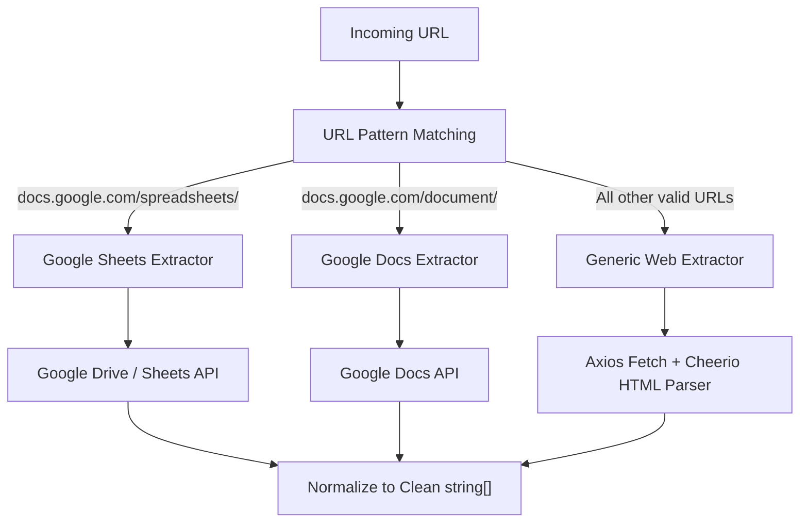

# URL Ingestion Flow

## Overview

The URL ingestion handler processes remote links submitted by users and routes them to specialized extractors based on host pattern matching.

## Extractors

### 1. Google Sheets (`googleSheet.extractor.ts`)
- Extracts document ID from `https://docs.google.com/spreadsheets/d/:sheetId`.
- Fetches sheet metadata and grid rows using `googleapis`.
- Formats cell values row-by-row into delimited textual strings preserving column relationships.

### 2. Google Docs (`googleDoc.extractor.ts`)
- Extracts document ID from `https://docs.google.com/document/d/:docId`.
- Fetches structured document body using Google Docs API.
- Extracts paragraphs, headings, bullet lists, and embedded hyperlinks.

### 3. Generic Webpages (`web.extractor.ts`)
- Fetches HTML via HTTP client with proper User-Agent headers.
- Uses **Cheerio** to strip boilerplate noise (`<nav>`, `<header>`, `<footer>`, `<script>`, `<style>`, ads).
- Preserves article headings, list items (`<li>`), tables, and anchor links (`<a>`).
- Strips excessive whitespace and returns clean content lines.

